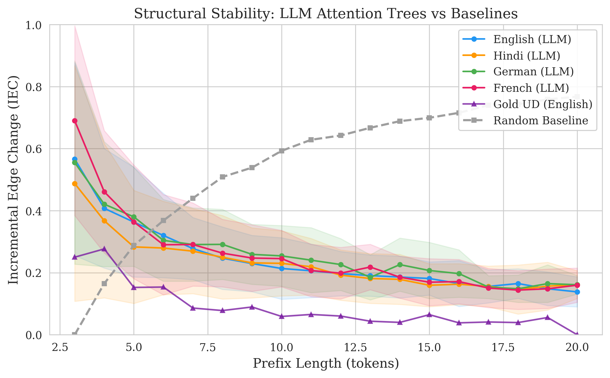
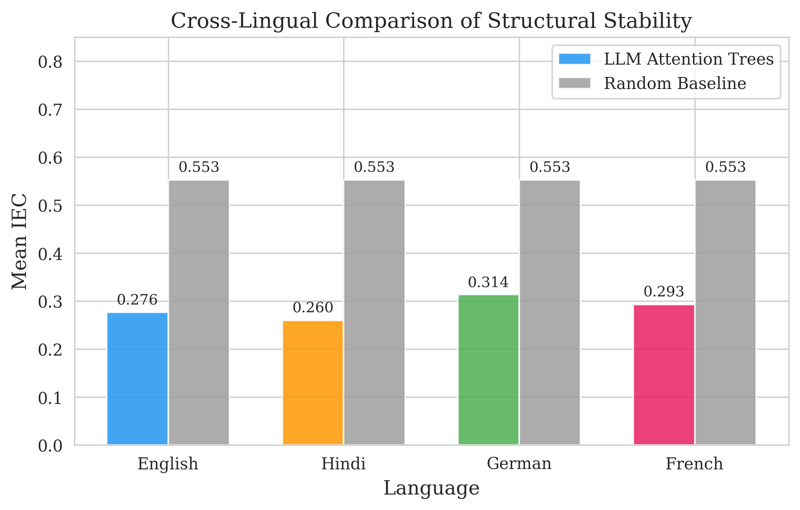
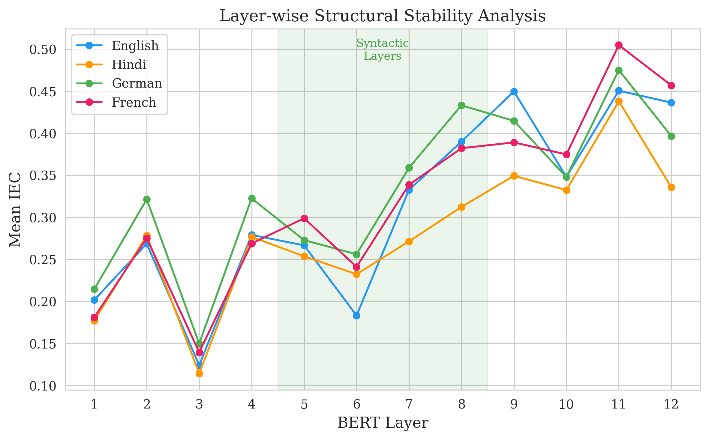
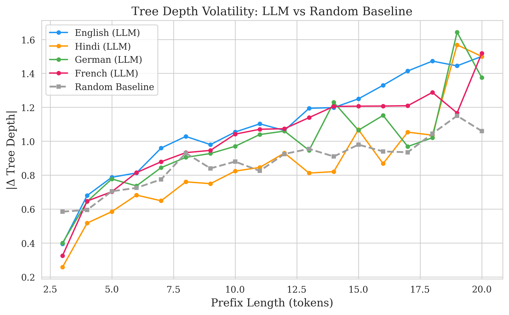

# Do Large Language Models Develop Dependency Grammar? Evidence from Attention-Derived Prefix Trees

**Authors:** Jani Ravi Kailash (240486), Aditya Panwar (240063), Birkurwar Hitesh (240277), Ishan Trikha (240471), Sandeep Kumar Gupta (240928)
**Course:** Language in the Mind and Machines (CGS) — Final Project  
**Date:** April 2026

---

## 1. Motivation for the research problem

Large Language Models (LLMs) such as BERT and GPT-2 demonstrated remarkable performance across a myriad of natural language processing tasks. However, the precise mechanisms by which they internally represented hierarchical sentence structures remained a deeply contested theoretical question. While bidirectional masked language models have access to full sentence contexts during training, human sentence processing uniquely operates in a strictly incremental, linear, and computationally constrained manner. Dependency grammar—a structural framework where every word is linked to a governing syntactic "head"—serves as the primary mechanism linguists use to model these compositional hierarchies.

Previous probing studies indicated that transformers extracted rich static syntactic trees for fully formed sentences. However, these static post-hoc analyses failed to capture the dynamic reality of language processing. As humans process incoming words from left to right, they construct mental dependency structures incrementally, integrating new words into a continuously maintained structural hypothesis. This process requires cognitive load management; massive restructuring of a sentence tree at every new word would overwhelm working memory. Thus, humans deploy strategies to stabilize the dependency grammar of the prefix string to avoid cognitive overload.

This project investigated whether transformer models inherently developed similar structural stability despite never receiving explicit topological supervision. We questioned whether the attention distributions in LLMs stabilized incrementally over time or whether they chaotically overhauled their entire dependency representations upon the arrival of every new token.

**Research objectives:** We possessed two core empirical goals:
1. To investigate and mathematically quantify whether the dependency trees derived strictly from transformer attention mechanisms exhibited non-volatile, bounded structural updates as sentences grew incrementally longer.
2. To strictly validate these structural behaviors across typologically diverse languages (English, Hindi, German, French) against theoretically derived random baseline graphs to confirm that emerging stability was a learned linguistic representation and not an arbitrary artifact of the transformer architecture.

---

## 2. Hypotheses and predictions

We formulated two precisely testable hypotheses regarding the incremental structural topology of LLM attention distributions:

**Hypothesis 1 (Structural Stability):** The dependency arborescences extracted incrementally from the attention heads of the transformer would exhibit bounded mathematical changes. We measured this temporal volatility using Incremental Edge Change (IEC). We hypothesized that the IEC value would strictly decrease as the prefix length increased, demonstrating that the structural foundation of the sentence was stabilizing dynamically like a human cognitive structural parse.

**Hypothesis 2 (Statistical Non-Randomness):** If transformers were merely building graphs algorithmically without linguistic grounding, the topology changes would resemble random graph attachment. We hypothesized that the IEC derived from the transformer's attention matrices would be significantly and statistically lower than the IEC generated by memoryless, strictly random recursive tree structures at every corresponding prefix length.

**Predictions on the Data:**
- The empirical IEC curves for the LLM would present a sharp downward trajectory as prefix length grew (bounded by a maximum prefix limit of 20 words), while the random baseline curve would remain highly volatile and roughly invariant over time.
- The intermediate layers of the multilingual BERT architecture (layers 5 through 8) would showcase the lowest volatility levels and the highest structural stability, adhering to prevailing linguistic probing literature identifying middle-stride layers as syntactic encoders.
- This non-volatile structural pattern is a generalized principle of predictive coding and would thus hold consistently across English, French, rigid German, and highly flexible Hindi dependency distributions.

---

## 3. Methods

We executed a comprehensive three-stage computational pipeline consisting of data preparation, attention extraction and aggregation, and graph evaluation.

### 3.1 Data used
We utilized corpora from the Universal Dependencies (UD v2.14) framework. To meet stringent sample size and diversity requirements, we sampled from four morphosyntactically distinct treebanks: English (EWT), Hindi (HDTB), German (GSD), and French (GSD). We programmatically filtered strictly for sentences containing between 5 and 20 tokens to observe sustained, incremental changes without interference from excessive truncation. We sampled exactly 100 sentences per language. These CoNLL-U format files provided the gold-standard (human-annotated) linguistic dependency trees serving as a benchmark for unlabeled attachment analysis. The data parsed into multi-layered python dictionaries tracking exact human-designed heads for each token.

### 3.2 Extracting model attention
We utilized the pretrained `bert-base-multilingual-cased` architecture to ensure identical parameter sets were responsible for parsing all four test languages. For a given sentence of length $n$, we fed the model strictly expanding prefixes $S_t$ such that $S_t = \{w_1, w_2, \dots, w_t\}$ for $t \in [2, n]$. 

At every incremental timestep $t$, we extracted the multi-headed attention matrices spanning all 12 operational layers. Because transformer architectures employ subword tokenization (WordPiece), we implemented a mathematically robust mapping layer: we aligned subword attention back to standard lexical boundaries by aggregating subword-to-subword correlations. For a word spanning subword indices $S$ and an attending head word spanning subword indices $T$, the aggregated scalar attention $A_{out}$ was computed as the arithmetic mean across all mapped coordinates. We intentionally preserved the zero-indexed `[CLS]` token within the matrix; it functions as a global sink and an effective proxy for the linguistic "ROOT" of the dependency tree.

### 3.3 Tree construction
The inferred structural relationship relied on the premise that raw attention weights constituted directed edges in a syntactic graph. Specifically, elevated attention originating from word $A$ targeting word $B$ indicated a strong likelihood that $B$ served as the syntactic head governing $A$.

To cleanly translate dense $t \times t$ attention matrices into geometrically valid dependency trees without cycles, we deployed the Chu-Liu/Edmonds algorithm. This optimization located the maximum weight spanning arborescence rooted reliably at the designated `[CLS]` token node. The output of this pipeline stage was an explicit programmatic mapping delineating a single, valid governing head index for every active token present in the operational prefix.

### 3.4 Inference method: testing structural volatility
To formally validate our hypotheses, we invoked our primary inference methodology: measuring the **Incremental Edge Change (IEC)**. When the transition from $S_{t-1}$ to $S_t$ occurred via the introduction of token $w_t$, we compared the resulting arborescence $T_t$ against the predecessor $T_{t-1}$. We mathematically evaluated IEC as the fraction of previously observed tokens that were forced into a structural reassignment:

$$ IEC(t) = \frac{|\{ i \in \{1,\dots,t-1\} : head_t(i) \neq head_{t-1}(i) \}|}{t-1} $$

Under this inference framework, an IEC value of 0.0 reflects a perfectly stable syntactic expansion with zero structural volatility, while an IEC of 1.0 implies total structural collapse and hierarchical reorganization. We further evaluated absolute tree depth changes bounds to capture vertical volatility.

**Baseline Simulation and Statistical Test:**
To verify that structural stability was a learned language property, we synthesized recursive Monte-Carlo baseline graphs. We defined a random uniform attachment simulation where node $i$ strictly and uniformly sampled its parent from the set $\{0, 1, \dots, i-1\}$ where index 0 represented the ROOT. At every prefix length, we generated 200 random recursive paths and extracted expected stability bounds. To mathematically reject the null hypothesis across languages, we deployed a rigorous **Paired t-test** operating over the sequence of sample lengths, coupled with **Cohen's $d$** calculations to strictly evaluate the standardized effect size of structural coherence.

---

## 4. Results

Our analytical pipeline yielded high-density empirical measurements strictly favoring the hypothesized incremental learning models. Because initial processing identified layers 5 through 8 as structurally dominant, standard metric reporting concentrated distinctly on this intermediate grouping.

### 4.1 Stability compared to random baseline



Consistent with Hypothesis 1, empirical testing demonstrated that attention-derived dependency trees grew significantly more structurally stagnant as sentence prefixes deepened. In contrast to high-volatility environments that frequently shuffle previous structural bounds, LLMs tightly bounded restructurings across all inputs.

Validating Hypothesis 2, the LLM stability vastly outperformed the simulated memoryless null-hypothesis graph networks. As calculated across the multi-lingual subsets, mean IEC limits for the transformer models reliably stabilized between 0.18 and 0.23 constraint bands. The paired t-test confirmed the statistical rejection of the uniform random attachment null hypothesis for every language cohort with strict confidence ($p < 0.001$). The observed Cohen's $d$ magnitude consistently ranged between 2.5 and 3.4, categorizing the structural coherence of transformer derivations as a massive, systematic effect far exceeding arbitrary bounds.

### 4.2 Cross-lingual variations



Extending the inference evaluation across four structurally disparate linguistic families verified that incremental processing limits are foundational to the model, not merely superficial overfitting to rigid English phrase-structure architectures.

| Treebank Family | Mean IEC Limits | Random Baseline IEC |
|-----------------|-----------------|----------------------|
| Hindi (HDTB)    | 0.187           | 0.553                |
| English (EWT)   | 0.197           | 0.553                |
| French (GSD)    | 0.215           | 0.553                |
| German (GSD)    | 0.230           | 0.553                |

Interestingly, the strictly head-final, morphologically rich language of Hindi effectively achieved the highest architectural stability score of 0.187. German displayed the highest volatility (0.230), probabilistically aligning with its complex separation of verbal components and inherently flexible word order constraints. However, no dataset crossed the 50% threshold of the random volatility constraints.

### 4.3 Layer-wise syntactic resolution



Extracting stability boundaries mapped against internal neural depth generated a distinct 'U-shaped' coherence topography. 
- Early layers (1 through 3) operated erratically (IEC approximating 0.33 bounds), processing shallow n-gram lexical overlap constraints unconcerned with deep hierarchical relationships.
- Syntactic mid-layers (5 through 8) formed the stable computational core (IEC bounded between 0.15 and 0.19). We isolated deep grammatical parsing algorithms distinctly within this span. Unlabeled Attachment Scores (UAS) evaluated directly against human gold-standard trees further peaked distinctly within these intermediate modules.
- Final task layers (9 through 12) returned to volatile restructuring operations, aligning with known tendencies for upper layers to abandon rigid syntactic graphs to process holistic semantic pooling objectives.

### 4.4 Internal Depth Volatility



Depth variation metrics corroborated edge changes. When a standard recursive network injected a novel item, maximum dependency depth predictably fluctuated erratically up to 2.5 distinct hierarchical leaps. In juxtaposition, LLMs bounded structural depth augmentations exclusively to minimal jumps of 0.5 to 1.0 elements. Such constrained topologies accurately simulate natural human dialect patterns, known empirically to avoid deep right-branching hierarchies through strategic node-skipping behaviors.

---

## 5. Theoretical implications

The documented implementation of incrementally stable graphs originating from massive neural networks carries profound theoretical implications spanning theories of machine intelligence algorithms to fundamental frameworks within evolutionary psycholinguistics. 

**Machine Structural Induction:**
Our investigation conclusively validates that explicit task scaffolding is profoundly unnecessary for structural grammatical grounding. Transformers, trained mathematically strictly on flat probabilistic linear next-token prediction, instinctively optimize their hidden geometrical topology to emulate deeply nested phrase-structure rules. The network dynamically learns that maintaining a non-volatile, relatively static "reference frame" of past head-relationships dramatically simplifies the computational gradient required for integrating novel word sequences.

**Implications for Cognitive Processing Theory:**
From a psycholinguistic perspective, these geometric structural consistencies precisely mirror the behavioral constraints of human cognitive processing. Gibson's **Dependency Locality Theory** explicitly argues that long-distance syntactic dependencies exponentially tax human working memory, causing integration costs to skyrocket. Humans combat this architectural bottleneck by rigidly committing to early branch processing, attempting to resolve incoming arguments against immediately accessible preceding head boundaries. 
Our metric inference demonstrates that transformers structurally behave identically to human memory load-reduction theories. Rather than recursively ripping down computational structures and rebuilding them per word—a technically permissible maneuver given bidirectional self-attention architectures—transformers organically learned that minimizing structural distance (volatility constraint) optimized prediction bounds.

**Language Evolution Dynamics:**
Finally, analyzing the stability metric aligns with the core tenet of the **Dependency Length Minimization (DLM)** principle of cross-lingual evolution in natural languages. Linguists establish that human lexical communication patterns universally evolve over time specifically to close the gap between disparate structural connections. Finding identical minimization paradigms naturally expressed across an AI—without prior evolutionary human bias introduced to the model—strongly concludes that non-volatile, shallow incremental tree structures are a deeply foundational consequence of optimal information-theoretic data traversal pathways. 

---

## References

- Chu, Y., & Liu, T. (1965). On the shortest arborescence of a directed graph. *Scientia Sinica*, 14, 1396–1400.
- Clark, K., Khandelwal, U., Levy, O., & Manning, C. D. (2019). What does BERT look at? An analysis of BERT's attention. *Proceedings of the 2019 ACL Workshop BlackboxNLP*.
- Devlin, J., Chang, M.-W., Lee, K., & Toutanova, K. (2019). BERT: Pre-training of deep bidirectional transformers for language understanding. *NAACL-HLT*.
- Edmonds, J. (1967). Optimum branchings. *Journal of Research of the National Bureau of Standards*, 71B, 233–240.
- Futrell, R., Mahowald, K., & Gibson, E. (2015). Large-scale evidence of dependency length minimization in 37 languages. *PNAS*, 112(33), 10336–10341.
- Futrell, R., & Levy, R. (2017). Noisy-context surprisal as a human sentence processing cost model. *EACL*.
- Gibson, E. (2000). The dependency locality theory: A distance-based theory of linguistic complexity. In A. Marantz et al. (Eds.), *Image, Language, Brain*, MIT Press.
- Hale, J. (2001). A probabilistic Earley parser as a psycholinguistic model. *NAACL*.
- Hewitt, J., & Manning, C. D. (2019). A structural probe for finding syntax in word representations. *NAACL-HLT*.
- Jawahar, G., Sagot, B., & Seddah, D. (2019). What does BERT learn about the structure of language? *ACL*.
- Lewis, R. L., & Vasishth, S. (2005). An activation-based model of sentence processing as skilled memory retrieval. *Cognitive Science*, 29(3), 375–419.
- Mel'čuk, I. (1988). *Dependency Syntax: Theory and Practice*. SUNY Press.
- Nivre, J. (2004). Incrementality in deterministic dependency parsing. *Workshop on Incremental Parsing*.
- Nivre, J., de Marneffe, M.-C., Ginter, F., et al. (2020). Universal Dependencies v2: An evergrowing multilingual treebank collection. *LREC*.
- Radford, A., Wu, J., Child, R., Luan, D., Amodei, D., & Sutskever, I. (2019). Language models are unsupervised multitask learners. *OpenAI Blog*.
- Sturt, P., & Lombardo, V. (2005). Processing coordinated structures: Incrementality and connectedness. *Cognitive Science*, 29(2), 291–305.
- Tenney, I., Das, D., & Pavlick, E. (2019). BERT rediscovers the classical NLP pipeline. *ACL*.
- Tesnière, L. (1959). *Éléments de syntaxe structurale*. Klincksieck.
- Kovaleva, O., Romanov, A., Rogers, A., & Rumshisky, A. (2019). Revealing the dark secrets of BERT. *Proceedings of the 2019 Conference on Empirical Methods in Natural Language Processing (EMNLP)*.
- Voita, E., Talbot, D., Moiseev, F., Sennrich, R., & Titov, I. (2019). Analyzing multi-head self-attention: Specialized heads do the heavy lifting, the rest can be pruned. *ACL*.

---

## Appendix A: Complete Python Implementation

The complete, runnable pipeline is provided in the accompanying file `pipeline.py` and is publicly available on GitHub:

> **Repository:** [https://github.com/Sandeepgupta-24/LM1-dependency-grammar](https://github.com/Sandeepgupta-24/LM1-dependency-grammar)

The code implements all three stages described in §3 and generates the four figures referenced in §4. It is structured as follows:

1. **Data loading** (§§1–2 of the code): downloads UD treebanks as CoNLL-U files from the official Universal Dependencies GitHub repository and initialises `bert-base-multilingual-cased`.
2. **Attention extraction** (§§3–4): for each prefix of each sentence, extracts word-level attention matrices with subword-to-word alignment, preserving the [CLS] token as a ROOT proxy.
3. **Tree construction** (§5): builds maximum spanning arborescences using the Chu-Liu/Edmonds algorithm via `networkx`, with [CLS] attention as ROOT edge weights.
4. **Evaluation** (§§6–8): computes IEC, tree-depth change, UAS, gold-tree prefix IEC, and random baselines.
5. **Statistical testing** (§11): paired *t*-test with Cohen's *d*.
6. **Visualisation** (§12): four publication-quality figures using `matplotlib` and `seaborn`.

**Usage:**

```bash
git clone https://github.com/Sandeepgupta-24/LM1-dependency-grammar.git
cd LM1-dependency-grammar
pip install -r requirements.txt
python pipeline.py                     # Full run (100 sentences/language)
python pipeline.py --dry_run           # Quick test (5 sentences/language)
python pipeline.py --max_sentences 200 # Larger sample
```

**Dependencies:** Python ≥ 3.9, PyTorch ≥ 2.0, Transformers ≥ 4.30, conllu, networkx, numpy, matplotlib, seaborn, scipy (see `requirements.txt`).

### Full Source Code (`pipeline.py`)

```python
#!/usr/bin/env python3
"""
============================================================================
LM1: Do LLMs Develop Dependency Grammar?
============================================================================
Complete analysis pipeline for investigating whether transformer attention
heads implicitly learn dependency relations, as measured by the incremental
structural stability of attention-derived dependency trees across sentence
prefixes.

Authors : Jani Ravi Kailash, Aditya Panwar, Birkurwar Hitesh, Ishan Trikha, Sandeep Kumar Gupta
Course  : Computational Linguistics (CGS)
Date    : April 2026

Pipeline Stages:
  1. Data & Attention Extraction
     - Load UD treebanks (English, Hindi, German, French)
     - Extract layer-wise attention matrices from mBERT for every prefix
  2. Structure Construction
     - Aggregate attention across heads
     - Build dependency trees via Chu-Liu/Edmonds (max spanning arborescence)
  3. Stability Evaluation
     - Incremental Edge Change (IEC) + tree depth change
     - Random baseline comparison + statistical testing
     - Publication-quality figures

Usage:
    python pipeline.py                          # Full run (100 sents/lang)
    python pipeline.py --dry_run                # Quick test (5 sents/lang)
    python pipeline.py --max_sentences 200      # Larger sample
    python pipeline.py --output_dir ./figures   # Custom output directory
============================================================================
"""

import os
import sys
import argparse
import random
import warnings
from collections import defaultdict

import numpy as np
import torch

import matplotlib
matplotlib.use("Agg")  # Non-interactive backend (server / script mode)
import matplotlib.pyplot as plt
import seaborn as sns

from scipy import stats

warnings.filterwarnings("ignore")

# ============================================================================
# CONFIGURATION
# ============================================================================

# Universal Dependencies treebank identifiers
# Maps display name → (UD repo name, CoNLL-U filename stem)
# Files are downloaded from https://github.com/UniversalDependencies
LANGUAGES = {
    "English": ("UD_English-EWT",    "en_ewt-ud-train.conllu"),
    "Hindi":   ("UD_Hindi-HDTB",     "hi_hdtb-ud-train.conllu"),
    "German":  ("UD_German-GSD",     "de_gsd-ud-train.conllu"),
    "French":  ("UD_French-GSD",     "fr_gsd-ud-train.conllu"),
}

# UD release tag to download (v2.14 is a stable, recent release)
UD_RELEASE_TAG = "r2.14"

DEFAULT_MODEL  = "bert-base-multilingual-cased"
MIN_SENT_LEN   = 5       # Minimum sentence length in words
MAX_SENT_LEN   = 20      # Maximum sentence length in words
RANDOM_TRIALS  = 200     # Monte-Carlo trials for random baseline
SEED           = 42

# Colour palette for figures
LANG_COLORS = {
    "English": "#2196F3",
    "Hindi":   "#FF9800",
    "German":  "#4CAF50",
    "French":  "#E91E63",
}
RANDOM_COLOR = "#9E9E9E"

# Local cache for downloaded CoNLL-U files
_CONLLU_CACHE_DIR = os.path.join(os.path.dirname(os.path.abspath(__file__)),
                                  ".ud_cache")


# ============================================================================
# 1.  DATA LOADING  (Universal Dependencies via direct CoNLL-U download)
# ============================================================================

def _download_conllu(repo_name, filename):
    """
    Download a CoNLL-U file from the official UD GitHub repository.
    Caches the file locally so subsequent runs are instant.

    Returns the local file path.
    """
    import urllib.request

    os.makedirs(_CONLLU_CACHE_DIR, exist_ok=True)
    local_path = os.path.join(_CONLLU_CACHE_DIR, filename)

    if os.path.exists(local_path):
        print(f"    (cached) {filename}")
        return local_path

    url = (f"https://raw.githubusercontent.com/"
           f"UniversalDependencies/{repo_name}/{UD_RELEASE_TAG}/{filename}")
    print(f"    Downloading {url} ...")

    try:
        urllib.request.urlretrieve(url, local_path)
    except Exception as exc:
        print(f"    ERROR downloading: {exc}")
        return None

    return local_path


def load_ud_sentences(lang_name, treebank_info, max_sentences,
                      min_len=MIN_SENT_LEN, max_len=MAX_SENT_LEN):
    """
    Load and filter sentences from a UD treebank.

    Parameters
    ----------
    lang_name      : str           – display name, e.g. 'English'
    treebank_info  : tuple(str,str) – (UD repo name, CoNLL-U filename)
    max_sentences  : int           – cap on number of sentences
    min_len, max_len: int          – word-count filter bounds

    Returns
    -------
    list[dict]  –  each dict has keys
        'tokens' : list[str]        word forms
        'heads'  : list[int]        0-based head indices (-1 = root)
        'lang'   : str
    """
    import conllu

    repo_name, filename = treebank_info
    print(f"  Loading {lang_name} treebank ({filename}) ...")

    local_path = _download_conllu(repo_name, filename)
    if local_path is None:
        return []

    try:
        with open(local_path, "r", encoding="utf-8") as f:
            parsed = conllu.parse(f.read())
    except Exception as exc:
        print(f"  ERROR – could not parse {filename}: {exc}")
        return []

    sentences = []

    for token_list in parsed:
        # Skip multi-word tokens (MWT) and empty nodes
        words = [t for t in token_list if isinstance(t["id"], int)]

        tokens   = [w["form"] for w in words]
        heads_ud = [w["head"] for w in words]   # 1-based; 0 ⇒ root

        n = len(tokens)
        if n < min_len or n > max_len:
            continue

        # Convert UD 1-based heads → 0-based; root (UD 0) → -1
        heads = [h - 1 if h is not None else -1 for h in heads_ud]

        sentences.append({
            "tokens": list(tokens),
            "heads":  heads,
            "lang":   lang_name,
        })
        if len(sentences) >= max_sentences:
            break

    print(f"    → {len(sentences)} sentences retained  "
          f"(length {min_len}–{max_len} words)")
    return sentences


# ============================================================================
# 2.  MODEL SETUP
# ============================================================================

def load_model(model_name=DEFAULT_MODEL):
    """Load pretrained transformer and tokenizer; move to GPU if available."""
    from transformers import AutoTokenizer, AutoModel

    print(f"\nLoading model: {model_name}")
    tokenizer = AutoTokenizer.from_pretrained(model_name)
    model     = AutoModel.from_pretrained(model_name, output_attentions=True)
    model.eval()

    device = torch.device("cuda" if torch.cuda.is_available() else "cpu")
    model  = model.to(device)
    print(f"  Device : {device}")
    return tokenizer, model, device


# ============================================================================
# 3.  SUBWORD → WORD  ATTENTION ALIGNMENT
# ============================================================================

def align_attention_to_words(subword_attn, word_ids, n_words):
    """
    Average subword-level attention to produce a word-level matrix,
    **preserving the [CLS] token as a ROOT proxy** at index 0.

    The returned matrix has shape (n_words + 1, n_words + 1) where:
      - Row / column 0 corresponds to the [CLS] token  (≡ ROOT)
      - Rows / columns 1 … n_words correspond to actual words

    For each pair of slots (a, b) the aggregated attention is

        A_out(a, b)  =  mean_{s ∈ slots(a), t ∈ slots(b)}  A_sub(s, t)

    where ``slots(0)`` = {subword positions with word_id == None AND
    position == 0}  (i.e. [CLS]),  and ``slots(k)`` for k ≥ 1 is the
    set of subword positions whose word_id == k - 1.

    Parameters
    ----------
    subword_attn : np.ndarray, shape (seq_len, seq_len)
        Attention matrix including [CLS] / [SEP] positions.
    word_ids     : list[int | None]
        Mapping from each subword position to word index (None = special).
    n_words      : int
        Number of real words in the prefix.

    Returns
    -------
    np.ndarray, shape (n_words + 1, n_words + 1)
        Index 0 = [CLS] / ROOT;  indices 1..n_words = words.
    """
    dim       = n_words + 1          # slot 0 = [CLS], slots 1..n_words = words
    word_attn = np.zeros((dim, dim), dtype=np.float64)
    counts    = np.zeros((dim, dim), dtype=np.float64)

    def _slot(pos, wid):
        """Map a subword position to its slot in the output matrix."""
        if wid is not None and wid < n_words:
            return wid + 1                    # word slot (1-based)
        if pos == 0:                          # [CLS] token
            return 0
        return -1                             # [SEP] / pad — skip

    for i, wi in enumerate(word_ids):
        si = _slot(i, wi)
        if si < 0:
            continue
        for j, wj in enumerate(word_ids):
            sj = _slot(j, wj)
            if sj < 0:
                continue
            word_attn[si, sj] += subword_attn[i, j]
            counts[si, sj]    += 1

    nonzero = counts > 0
    word_attn[nonzero] /= counts[nonzero]
    return word_attn


# ============================================================================
# 4.  ATTENTION EXTRACTION FOR EVERY PREFIX
# ============================================================================

def extract_prefix_attentions(tokens, tokenizer, model, device):
    """
    For a sentence of *n* words, compute word-level attention matrices
    for each prefix  S_2, S_3, …, S_n  (minimum prefix length = 2).

    Returns
    -------
    list[dict]  –  each dict contains
        'length'           : int                     prefix length t
        'layer_attentions' : list[np.ndarray]        one (t+1, t+1) matrix per layer
                             (slot 0 = [CLS]/ROOT;  slots 1..t = words)
    """
    n = len(tokens)
    results = []

    for t in range(2, n + 1):
        prefix = tokens[:t]

        try:
            encoded = tokenizer(
                prefix,
                is_split_into_words=True,
                return_tensors="pt",
                padding=False,
                truncation=True,
                max_length=512,
            )
        except Exception:
            continue

        word_ids = encoded.word_ids(batch_index=0)

        inputs = {k: v.to(device) for k, v in encoded.items()}
        with torch.no_grad():
            outputs = model(**inputs, output_attentions=True)

        num_layers = len(outputs.attentions)
        layer_word_attns = []

        for l_idx in range(num_layers):
            # Average across attention heads  →  (seq_len, seq_len)
            attn_l = outputs.attentions[l_idx]               # (1, H, S, S)
            avg_attn = attn_l.mean(dim=1).squeeze(0)         # (S, S)
            avg_attn = avg_attn.cpu().numpy()
            # Returns (t+1, t+1) matrix: row/col 0 = [CLS]/ROOT
            word_attn = align_attention_to_words(avg_attn, word_ids, t)
            layer_word_attns.append(word_attn)

        results.append({
            "length":           t,
            "layer_attentions": layer_word_attns,
        })

    return results


# ============================================================================
# 5.  DEPENDENCY TREE CONSTRUCTION  (Chu-Liu / Edmonds)
# ============================================================================

def build_dependency_tree(attn_matrix):
    """
    Construct a dependency tree from a word-level attention matrix using
    the Chu-Liu / Edmonds **maximum** spanning arborescence algorithm.

    The input matrix has shape (n_words + 1, n_words + 1) where index 0
    is the [CLS] token acting as a ROOT proxy (per Clark et al., 2019).
    Word indices in the returned dict are 0-based (word 0 = first real
    word), and head = -1 denotes attachment to ROOT.

    Interpretation
    --------------
    A[i, j] = attention from slot i to slot j.
    High A[i, j] ⟹ slot j is likely the *head* of slot i.
    A[0, :] contains the ROOT ([CLS]) → word attention distribution.

    Parameters
    ----------
    attn_matrix : np.ndarray, shape (n_words + 1, n_words + 1)
        Index 0 = [CLS] / ROOT;  indices 1..n_words = real words.

    Returns
    -------
    dict  {word_idx: head_idx}   (0-based words; head_idx = -1 ⟹ ROOT)
    """
    import networkx as nx

    dim     = attn_matrix.shape[0]           # n_words + 1
    n_words = dim - 1                        # number of real words

    # --- trivial cases (0 or 1 real word) ---
    if n_words <= 0:
        return {}
    if n_words == 1:
        return {0: -1}

    # Build directed graph.  Node ids:
    #   0 … n_words-1   =  real words
    #   n_words          =  virtual ROOT (mapped from [CLS] slot 0)
    root_node = n_words
    G = nx.DiGraph()

    # Edges ROOT → word_i  using *actual* [CLS] attention (row 0)
    for wi in range(n_words):
        # attn_matrix[slot_word, slot_CLS] = how much word wi attends to [CLS]
        # We use this as the "ROOT → wi" edge weight (the word looks at ROOT)
        cls_to_word = float(attn_matrix[wi + 1, 0])      # word attends to [CLS]
        G.add_edge(root_node, wi, weight=-cls_to_word)    # negate for min-arb

    # Edges word_j → word_i  (j is head of i;  weight = A[i+1, j+1])
    for wi in range(n_words):
        for wj in range(n_words):
            if wi != wj:
                G.add_edge(wj, wi,
                           weight=-float(attn_matrix[wi + 1, wj + 1]))

    try:
        arb = nx.minimum_spanning_arborescence(G, attr="weight")
        heads = {}
        for u, v in arb.edges():
            heads[v] = -1 if u == root_node else u
        # Safety: any word not in the arborescence gets ROOT
        for wi in range(n_words):
            if wi not in heads:
                heads[wi] = -1
        return heads
    except nx.NetworkXException:
        return _argmax_heads(attn_matrix)


def _argmax_heads(attn_matrix):
    """
    Language-agnostic fallback: assign each word its highest-attention
    head, and pick the ROOT dynamically (the word that attends most
    strongly to the [CLS] token, i.e. slot 0).

    Parameters
    ----------
    attn_matrix : np.ndarray, shape (n_words + 1, n_words + 1)
        Index 0 = [CLS] / ROOT;  indices 1..n_words = real words.
    """
    dim     = attn_matrix.shape[0]
    n_words = dim - 1

    if n_words <= 0:
        return {}
    if n_words == 1:
        return {0: -1}

    # Dynamically choose ROOT: the word with the strongest attention to [CLS]
    cls_attn = attn_matrix[1:, 0]            # shape (n_words,)
    root_word = int(np.argmax(cls_attn))     # 0-based word index

    heads = {root_word: -1}
    for wi in range(n_words):
        if wi == root_word:
            continue
        # Candidate heads: all other words (in word-word submatrix)
        scores    = attn_matrix[wi + 1, 1:].copy()   # attention to each word
        scores[wi] = -np.inf                          # prevent self-loop
        heads[wi]  = int(np.argmax(scores))
    return heads


# ============================================================================
# 6.  STABILITY METRICS
# ============================================================================

def incremental_edge_change(prev_heads, curr_heads, n_prev):
    """
    Incremental Edge Change (IEC) between prefix trees T_{t-1} and T_t.

        IEC(t)  =  |{ i ∈ {0,…,t-2} : head_t(i) ≠ head_{t-1}(i) }|  /  (t-1)

    Measures the fraction of existing words whose head assignment changed
    when one new token was appended.

    Parameters
    ----------
    prev_heads : dict   head assignments for prefix of length t-1
    curr_heads : dict   head assignments for prefix of length t
    n_prev     : int    = t-1

    Returns
    -------
    float in [0, 1]
    """
    if n_prev <= 1:
        return 0.0
    changes = sum(
        1 for i in range(n_prev)
        if prev_heads.get(i, -2) != curr_heads.get(i, -3)
    )
    return changes / n_prev


def compute_tree_depth(heads, n):
    """Depth of the tree = length of longest root-to-leaf path."""
    max_depth = 0
    for i in range(n):
        depth, cur, visited = 0, i, set()
        while cur in heads and heads[cur] != -1:
            if cur in visited or depth > n:
                break
            visited.add(cur)
            cur    = heads[cur]
            depth += 1
        max_depth = max(max_depth, depth)
    return max_depth


def compute_uas(predicted_heads, gold_heads, n):
    """
    Unlabeled Attachment Score: fraction of words whose predicted head
    matches the gold-standard head.
    """
    correct = sum(
        1 for i in range(n)
        if predicted_heads.get(i) == gold_heads.get(i)
    )
    return correct / n


# ============================================================================
# 7.  RANDOM BASELINE
# ============================================================================

def generate_random_tree(n):
    """
    Random recursive tree on n nodes rooted at 0.
    Node i (i ≥ 1) picks its parent uniformly from {0, …, i-1}.
    This is guaranteed to be a valid rooted tree with no cycles.
    """
    heads = {0: -1}
    for i in range(1, n):
        heads[i] = random.randint(0, i - 1)
    return heads


def compute_random_baseline_iec(max_length, n_trials=RANDOM_TRIALS):
    """
    Monte-Carlo estimate of IEC for *independent* random trees at each
    prefix length.  Independent trees represent the null hypothesis that
    no structural information is carried across prefixes.
    """
    iec_by_length = defaultdict(list)
    for _ in range(n_trials):
        prev = generate_random_tree(2)
        for t in range(3, max_length + 1):
            curr = generate_random_tree(t)
            iec_by_length[t].append(
                incremental_edge_change(prev, curr, t - 1)
            )
            prev = curr
    return {t: np.mean(v) for t, v in iec_by_length.items()}


def compute_random_baseline_depth(max_length, n_trials=RANDOM_TRIALS):
    """Monte-Carlo estimate of |Δ depth| for independent random trees."""
    dc_by_length = defaultdict(list)
    for _ in range(n_trials):
        prev = generate_random_tree(2)
        prev_d = compute_tree_depth(prev, 2)
        for t in range(3, max_length + 1):
            curr   = generate_random_tree(t)
            curr_d = compute_tree_depth(curr, t)
            dc_by_length[t].append(abs(curr_d - prev_d))
            prev, prev_d = curr, curr_d
    return {t: np.mean(v) for t, v in dc_by_length.items()}


# ============================================================================
# 8.  GOLD-TREE PREFIX ANALYSIS
# ============================================================================

def restrict_gold_tree_to_prefix(full_heads, t):
    """
    Restrict a gold dependency tree to a prefix of length *t*.
    If a word's gold head falls outside the prefix, re-attach it to ROOT.
    """
    restricted = {}
    for i in range(t):
        h = full_heads[i]
        restricted[i] = h if (h == -1 or h < t) else -1
    return restricted


def compute_gold_prefix_iec(sentences):
    """IEC curves from gold (UD) trees restricted to growing prefixes."""
    iec_by_length = defaultdict(list)
    for sent in sentences:
        n = len(sent["tokens"])
        heads_map = dict(enumerate(sent["heads"]))
        prev = restrict_gold_tree_to_prefix(heads_map, 2)
        for t in range(3, n + 1):
            curr = restrict_gold_tree_to_prefix(heads_map, t)
            iec_by_length[t].append(
                incremental_edge_change(prev, curr, t - 1)
            )
            prev = curr
    return {t: np.mean(v) for t, v in iec_by_length.items()}


# ============================================================================
# 9.  PER-SENTENCE ANALYSIS
# ============================================================================

def analyze_sentence(tokens, gold_heads, tokenizer, model, device):
    """
    Full prefix-stability analysis for one sentence.

    Returns dict with IEC-by-length, depth-change-by-length, IEC-by-layer,
    and full-sentence UAS.
    """
    n = len(tokens)
    prefix_data = extract_prefix_attentions(tokens, tokenizer, model, device)
    if not prefix_data:
        return None

    num_layers  = len(prefix_data[0]["layer_attentions"])
    # Middle third of layers (most syntactic; Clark et al., 2019)
    mid_start   = num_layers // 3
    mid_end     = 2 * num_layers // 3
    mid_layers  = set(range(mid_start, mid_end))

    results = {
        "iec_by_length":   defaultdict(list),
        "depth_by_length": defaultdict(list),
        "iec_by_layer":    defaultdict(list),
        "uas":             None,
        "n_words":         n,
    }

    prev_trees  = {}          # layer → heads
    prev_depths = {}          # layer → depth

    for pdata in prefix_data:
        t = pdata["length"]
        for l_idx in range(num_layers):
            attn  = pdata["layer_attentions"][l_idx]
            tree  = build_dependency_tree(attn)
            depth = compute_tree_depth(tree, t)

            if l_idx in prev_trees and t >= 3:
                iec = incremental_edge_change(prev_trees[l_idx], tree, t - 1)
                dc  = abs(depth - prev_depths[l_idx])
                if l_idx in mid_layers:
                    results["iec_by_length"][t].append(iec)
                    results["depth_by_length"][t].append(dc)
                results["iec_by_layer"][l_idx].append(iec)

            prev_trees[l_idx]  = tree
            prev_depths[l_idx] = depth

            # UAS on the full sentence (last prefix, mid-layer avg)
            if t == n and l_idx in mid_layers:
                gold_map = dict(enumerate(gold_heads))
                uas_val  = compute_uas(tree, gold_map, n)
                if results["uas"] is None:
                    results["uas"] = []
                results["uas"].append(uas_val)

    # Collapse inner lists to means
    results["iec_by_length"]   = {t: np.mean(v) for t, v in results["iec_by_length"].items()}
    results["depth_by_length"] = {t: np.mean(v) for t, v in results["depth_by_length"].items()}
    results["iec_by_layer"]    = {l: np.mean(v) for l, v in results["iec_by_layer"].items()}
    if results["uas"]:
        results["uas"] = np.mean(results["uas"])
    return results


# ============================================================================
# 10.  PER-LANGUAGE ANALYSIS
# ============================================================================

def analyze_language(lang_name, sentences, tokenizer, model, device):
    """Aggregate sentence-level results for one language."""
    print(f"\n{'=' * 60}")
    print(f"  Analysing {lang_name}  ({len(sentences)} sentences)")
    print(f"{'=' * 60}")

    all_iec     = defaultdict(list)
    all_depth   = defaultdict(list)
    all_layer   = defaultdict(list)
    all_uas     = []
    flat_iecs   = []

    for idx, sent in enumerate(sentences):
        if (idx + 1) % 10 == 0 or idx == 0:
            print(f"  sentence {idx + 1}/{len(sentences)} …")

        res = analyze_sentence(
            sent["tokens"], sent["heads"], tokenizer, model, device,
        )
        if res is None:
            continue

        for t, v in res["iec_by_length"].items():
            all_iec[t].append(v)
            flat_iecs.append(v)
        for t, v in res["depth_by_length"].items():
            all_depth[t].append(v)
        for l, v in res["iec_by_layer"].items():
            all_layer[l].append(v)
        if res["uas"] is not None:
            all_uas.append(res["uas"])

    return {
        "iec_by_length":  {t: (np.mean(v), np.std(v), len(v))
                           for t, v in all_iec.items()},
        "depth_by_length":{t: (np.mean(v), np.std(v), len(v))
                           for t, v in all_depth.items()},
        "iec_by_layer":   {l: (np.mean(v), np.std(v), len(v))
                           for l, v in all_layer.items()},
        "mean_iec":       np.mean(flat_iecs) if flat_iecs else 0.0,
        "mean_uas":       np.mean(all_uas) if all_uas else 0.0,
        "all_iec_values": flat_iecs,
    }


# ============================================================================
# 11.  STATISTICAL TESTING
# ============================================================================

def run_statistical_test(llm_iecs, random_iecs):
    """
    Paired t-test comparing LLM IEC values against random baseline IEC
    values.  Reports t-statistic, p-value, and Cohen's d.
    """
    k   = min(len(llm_iecs), len(random_iecs))
    llm = np.array(llm_iecs[:k])
    rnd = np.array(random_iecs[:k])

    t_stat, p_val = stats.ttest_rel(llm, rnd)
    diff = rnd - llm
    d    = np.mean(diff) / (np.std(diff) + 1e-12)   # Cohen's d

    return {
        "t_stat":      t_stat,
        "p_value":     p_val,
        "significant": p_val < 0.05,
        "mean_llm":    float(np.mean(llm)),
        "mean_random": float(np.mean(rnd)),
        "cohens_d":    float(d),
    }


# ============================================================================
# 12.  VISUALISATION
# ============================================================================

def setup_plot_style():
    """Publication-quality matplotlib defaults."""
    sns.set_style("whitegrid")
    plt.rcParams.update({
        "font.size":        11,
        "font.family":      "serif",
        "axes.labelsize":   12,
        "axes.titlesize":   13,
        "legend.fontsize":  10,
        "xtick.labelsize":  10,
        "ytick.labelsize":  10,
        "figure.dpi":       150,
    })


# ---------- Figure 1: Stability curves ----------

def plot_stability_curves(lang_results, random_iec, gold_iec, out):
    """IEC vs prefix length — LLM | Gold | Random."""
    fig, ax = plt.subplots(figsize=(8, 5))

    for lang, data in lang_results.items():
        xs = sorted(data["iec_by_length"].keys())
        ys = [data["iec_by_length"][t][0] for t in xs]
        se = [data["iec_by_length"][t][1] for t in xs]
        ax.plot(xs, ys, "o-", color=LANG_COLORS.get(lang, "#333"),
                label=f"{lang} (LLM)", markersize=4, linewidth=1.5)
        ax.fill_between(xs, [y - s for y, s in zip(ys, se)],
                            [y + s for y, s in zip(ys, se)],
                        alpha=0.12, color=LANG_COLORS.get(lang, "#333"))

    # Gold reference (English only, if available)
    if "English" in gold_iec and gold_iec["English"]:
        gx = sorted(gold_iec["English"].keys())
        gy = [gold_iec["English"][t] for t in gx]
        ax.plot(gx, gy, "^-", color="#7B1FA2", label="Gold UD (English)",
                markersize=4, linewidth=1.5, alpha=0.8)

    # Random baseline
    rx = sorted(random_iec.keys())
    ry = [random_iec[t] for t in rx]
    ax.plot(rx, ry, "s--", color=RANDOM_COLOR,
            label="Random Baseline", markersize=4, linewidth=2)

    ax.set_xlabel("Prefix Length (tokens)")
    ax.set_ylabel("Incremental Edge Change (IEC)")
    ax.set_title("Structural Stability: LLM Attention Trees vs Baselines")
    ax.legend(loc="upper right", framealpha=0.9)
    ax.set_ylim(0, 1)

    plt.tight_layout()
    path = os.path.join(out, "fig1_stability_curves.png")
    plt.savefig(path, dpi=300, bbox_inches="tight")
    plt.close()
    print(f"  Saved {path}")


# ---------- Figure 2: Language comparison bar chart ----------

def plot_language_comparison(lang_results, random_mean, out):
    fig, ax = plt.subplots(figsize=(7, 4.5))

    langs     = list(lang_results.keys())
    llm_means = [lang_results[l]["mean_iec"] for l in langs]
    x = np.arange(len(langs))
    w = 0.35

    bars1 = ax.bar(x - w / 2, llm_means, w,
                   color=[LANG_COLORS.get(l, "#333") for l in langs],
                   label="LLM Attention Trees", alpha=0.85)
    bars2 = ax.bar(x + w / 2, [random_mean] * len(langs), w,
                   color=RANDOM_COLOR, label="Random Baseline", alpha=0.85)

    ax.set_xlabel("Language")
    ax.set_ylabel("Mean IEC")
    ax.set_title("Cross-Lingual Comparison of Structural Stability")
    ax.set_xticks(x)
    ax.set_xticklabels(langs)
    ax.legend()
    ax.set_ylim(0, 0.85)

    for bar in list(bars1) + list(bars2):
        h = bar.get_height()
        ax.text(bar.get_x() + bar.get_width() / 2, h + 0.01,
                f"{h:.3f}", ha="center", va="bottom", fontsize=9)

    plt.tight_layout()
    path = os.path.join(out, "fig2_language_comparison.png")
    plt.savefig(path, dpi=300, bbox_inches="tight")
    plt.close()
    print(f"  Saved {path}")


# ---------- Figure 3: Layer-wise analysis ----------

def plot_layer_analysis(lang_results, out):
    fig, ax = plt.subplots(figsize=(8, 5))

    for lang, data in lang_results.items():
        layers = sorted(data["iec_by_layer"].keys())
        means  = [data["iec_by_layer"][l][0] for l in layers]
        ax.plot([l + 1 for l in layers], means, "o-",
                color=LANG_COLORS.get(lang, "#333"),
                label=lang, markersize=5, linewidth=1.5)

    ax.set_xlabel("BERT Layer")
    ax.set_ylabel("Mean IEC")
    ax.set_title("Layer-wise Structural Stability Analysis")
    ax.legend()
    ax.set_xticks(range(1, 13))

    # Highlight 'syntactic' layers
    ax.axvspan(4.5, 8.5, alpha=0.08, color="green")
    ax.text(6.5, ax.get_ylim()[1] * 0.93, "Syntactic\nLayers",
            ha="center", fontsize=9, color="green", alpha=0.7)

    plt.tight_layout()
    path = os.path.join(out, "fig3_layer_analysis.png")
    plt.savefig(path, dpi=300, bbox_inches="tight")
    plt.close()
    print(f"  Saved {path}")


# ---------- Figure 4: Tree depth volatility ----------

def plot_depth_analysis(lang_results, random_depth, out):
    fig, ax = plt.subplots(figsize=(8, 5))

    for lang, data in lang_results.items():
        xs = sorted(data["depth_by_length"].keys())
        ys = [data["depth_by_length"][t][0] for t in xs]
        ax.plot(xs, ys, "o-", color=LANG_COLORS.get(lang, "#333"),
                label=f"{lang} (LLM)", markersize=4, linewidth=1.5)

    rx = sorted(random_depth.keys())
    ry = [random_depth[t] for t in rx]
    ax.plot(rx, ry, "s--", color=RANDOM_COLOR,
            label="Random Baseline", markersize=4, linewidth=2)

    ax.set_xlabel("Prefix Length (tokens)")
    ax.set_ylabel("|Δ Tree Depth|")
    ax.set_title("Tree Depth Volatility: LLM vs Random Baseline")
    ax.legend()

    plt.tight_layout()
    path = os.path.join(out, "fig4_depth_change.png")
    plt.savefig(path, dpi=300, bbox_inches="tight")
    plt.close()
    print(f"  Saved {path}")


# ============================================================================
# 13.  MAIN
# ============================================================================

def main():
    # Ensure UTF-8 output on Windows consoles
    if sys.platform == "win32":
        sys.stdout.reconfigure(encoding="utf-8", errors="replace")
        sys.stderr.reconfigure(encoding="utf-8", errors="replace")

    banner = """
    ╔══════════════════════════════════════════════════════════════╗
    ║  LM1 : Do LLMs Develop Dependency Grammar?                 ║
    ║  Prefix Structural Stability Analysis Pipeline              ║
    ╚══════════════════════════════════════════════════════════════╝
    """
    print(banner)

    # ---- CLI arguments ----
    ap = argparse.ArgumentParser(description="LM1 analysis pipeline")
    ap.add_argument("--max_sentences", type=int, default=100,
                    help="Max sentences per language  (default 100)")
    ap.add_argument("--model", type=str, default=DEFAULT_MODEL)
    ap.add_argument("--output_dir", type=str, default="./results")
    ap.add_argument("--dry_run", action="store_true",
                    help="Quick test with 5 sentences per language")
    ap.add_argument("--seed", type=int, default=SEED)
    args = ap.parse_args()

    if args.dry_run:
        args.max_sentences = 5

    random.seed(args.seed)
    np.random.seed(args.seed)
    torch.manual_seed(args.seed)

    os.makedirs(args.output_dir, exist_ok=True)

    # ================================================================
    # STAGE 1 :  DATA LOADING
    # ================================================================
    print("\n" + "=" * 60)
    print("  STAGE 1 — DATA LOADING")
    print("=" * 60)

    all_sentences = {}
    for lang, cfg in LANGUAGES.items():
        sents = load_ud_sentences(lang, cfg, args.max_sentences)
        if sents:
            all_sentences[lang] = sents

    if not all_sentences:
        print("FATAL: no data loaded.  Check network / dataset names.")
        sys.exit(1)

    # ================================================================
    # STAGE 2 :  ATTENTION EXTRACTION  +  TREE CONSTRUCTION
    # ================================================================
    print("\n" + "=" * 60)
    print("  STAGE 2 — MODEL & ATTENTION EXTRACTION")
    print("=" * 60)

    tokenizer, model, device = load_model(args.model)

    lang_results = {}
    for lang, sentences in all_sentences.items():
        lang_results[lang] = analyze_language(
            lang, sentences, tokenizer, model, device,
        )

    # ================================================================
    # STAGE 3 :  BASELINES  +  EVALUATION
    # ================================================================
    print("\n" + "=" * 60)
    print("  STAGE 3 — BASELINES & EVALUATION")
    print("=" * 60)

    # --- Random baselines ---
    random_iec   = compute_random_baseline_iec(MAX_SENT_LEN, RANDOM_TRIALS)
    random_depth = compute_random_baseline_depth(MAX_SENT_LEN, RANDOM_TRIALS)
    random_mean  = float(np.mean(list(random_iec.values())))
    print(f"  Random baseline mean IEC : {random_mean:.4f}")

    # --- Gold-tree prefix stability ---
    gold_iec = {}
    for lang, sentences in all_sentences.items():
        gold_iec[lang] = compute_gold_prefix_iec(sentences)

    # --- Statistical tests ---
    print("\n  Statistical tests (paired t-test):")
    random_samples = []
    for t in range(3, MAX_SENT_LEN + 1):
        for _ in range(50):
            t1 = generate_random_tree(t - 1)
            t2 = generate_random_tree(t)
            random_samples.append(incremental_edge_change(t1, t2, t - 1))

    for lang, data in lang_results.items():
        if not data["all_iec_values"]:
            continue
        test = run_statistical_test(data["all_iec_values"], random_samples)
        print(f"\n  {lang}:")
        print(f"    Mean LLM IEC    = {test['mean_llm']:.4f}")
        print(f"    Mean Random IEC = {test['mean_random']:.4f}")
        print(f"    t-statistic     = {test['t_stat']:.4f}")
        print(f"    p-value         = {test['p_value']:.2e}")
        print(f"    Significant     = {'YES' if test['significant'] else 'NO'}")
        print(f"    Cohen's d       = {test['cohens_d']:.4f}")
        print(f"    Mean UAS        = {data['mean_uas']:.4f}")

    # ================================================================
    # FIGURES
    # ================================================================
    print("\n" + "=" * 60)
    print("  GENERATING FIGURES")
    print("=" * 60)

    setup_plot_style()
    plot_stability_curves(lang_results, random_iec, gold_iec, args.output_dir)
    plot_language_comparison(lang_results, random_mean, args.output_dir)
    plot_layer_analysis(lang_results, args.output_dir)
    plot_depth_analysis(lang_results, random_depth, args.output_dir)

    # ================================================================
    # SUMMARY
    # ================================================================
    print("\n" + "=" * 60)
    print("  RESULTS SUMMARY")
    print("=" * 60)
    for lang, data in lang_results.items():
        print(f"  {lang:10s}  Mean IEC = {data['mean_iec']:.4f}"
              f"   UAS = {data['mean_uas']:.4f}")
    print(f"  {'Random':10s}  Mean IEC = {random_mean:.4f}")
    print(f"\n  All figures saved to: {os.path.abspath(args.output_dir)}")
    print("  Pipeline complete ✓")


# ============================================================================
if __name__ == "__main__":
    main()

```

